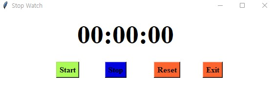

# StopWatch Program 
## 1. Introduction 
- StopWatch is a watch with a hand or a digital display that can be started and stopped at will for exact timing.
- For a watch that has water resistance, a 12/24-hour format display, a full auto-calendar, a daily alarm, and a stopwatch in addition to a fully functioning calculator, that’s a pretty good deal and gift for almost anyone.  
 

## 2. Guide Line
### 2-1. Before Use
    pip install tkinter
### 2-2. Using
    python stopwatch.py  
 

## 3.  Run

